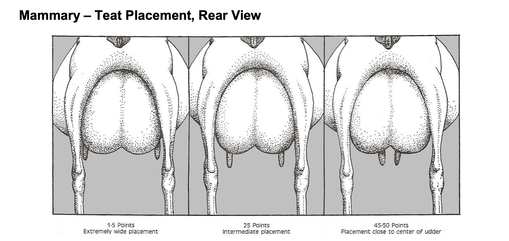
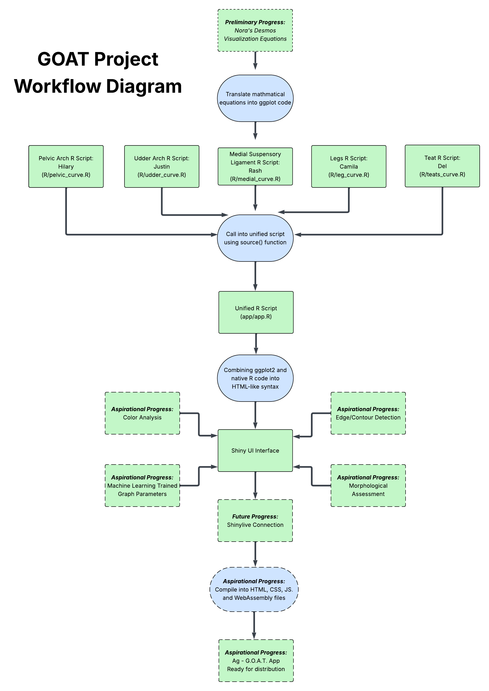

# Goat Observation Appraisal Tool (GOAT) 🐐

*Working Title – Subject to Revision*

*This is a live document, and will be subject to change as the project progresses*


## Background:


This project is being developed in collaboration with the American Dairy Goat Association (ADGA) and UC Davis.

ADGA is the primary organization that sets standards and maintains records for dairy goats in the U.S. One of its key programs is the Linear Appraisal System, which evaluates goats based on physical traits.

One of ADGA’s key programs is the Linear Appraisal System, which evaluates goats based on physical traits.

In this system, trained appraisers assess specific parts of a goat’s body (such as udder shape, leg structure, and body capacity) and assign each trait a score on a 1-50 scale.

Each score represents where the animal falls along a range of possible forms for that trait. For example, a low and high score for a trait correspond to different physical structures or positions, rather than “good” or “bad.”

This allows goats to be described in a consistent, standardized way across different appraisers.
The goal is to make evaluations more consistent and useful for:

* breeding decisions
* herd management
* research

However, these scores are still just numbers, which can be hard to interpret and compare visually.

## Project Focus: 

The goal is to build an application that takes linear appraisal scores for mammary traits and converts them into a visual model of the udder.

This project focuses specifically on the mammary system from the rear view (the udder and teat structures responsible for milk production), a component of dairy goat evaluation.

Key traits include:

* rear udder height
* udder depth
* udder arch
* medial support (udder split)
* teat placement and length

These traits affect milk production, udder health, and how long a dairy goat can stay productive.

This focus was chosen because the mammary system is important and can be difficult to evaluate consistently. In practice, appraisers often estimate traits visually, which can lead to variation in scores.

### Trait Reference (ADGA)

The diagram below shows an example of how one trait (teat placement) is visualized in the ADGA Linear Appraisal system.



*Source: American Dairy Goat Association (ADGA), Linear Appraisal materials (LABOOKLETALL_19.pdf).*

This diagram is included as a reference to show how numeric scores correspond to physical traits. In the ADGA system, scores reflect differences in position, proportion, and structure (such as how centrally the teats are placed on the udder).

--
In focusing on the rear view of the udder, this project:

* converts numeric scores into a visual representation
* makes these traits easier to interpret
* helps check consistency in scoring
* provides a reference for training and validation
*  support training outside of formal appraisal sessions  

## How It Works

This project takes linear appraisal scores and converts them into a visual model.

In simple terms:

- input trait scores  
- convert scores into shape parameters  
- generate a rear-view model of the udder  

This helps users:

- understand what the scores represent  
- compare different evaluations  
- check for consistency in scoring  

### Workflow Diagram



### Prototype / UI Planning

An early-stage prototype and UI planning materials can be found here:


[Figma Prototype / UI Planning](https://www.figma.com/design/ZpYCIH0f4AM39gjHRu5UR9/Ag-GOAT-UI?node-id=0-1&t=DCFXNh8wzVOKQWI8-1)


## SHARING/ACCESS INFORMATION 

### Liscense: AGPLv3 License 


## INSTALLATION

This project is developed in R and uses a Shiny-based interface.

Required packages:

`install.packages(c("tidyverse", "shiny", "magick"))`


## Data Organisation

### Google Drive Structure
[Google Drive]
(https://drive.google.com/drive/folders/1k2zZalMFZtyAQk7a1ZUKVJFEten8hQ5k?usp=sharing)

```
data/                         
├── Goat Pictures/                                 Images with scale reference (ruler) 
├── rear udder image library/                      Rear-view udder images
├──2025 LA Data_Cleaned.xlsx                       Cleaned linear appraisal dataset with goat trait scores and standardized variables for analysis and modeling  
└──2025 LA Data_Uncleaned.xlsx                     Raw linear appraisal dataset containing original recorded trait scores and animal information                      Images of miniature goats taken from rear 
scoping_documentation/
├── Linear Modeling Tool Grant_DataLab_2026.docx   Project proposal outlining goals, methods, and planned development
├── Scoping Meeting Notes                          Notes from initial project discussions and planning meetings
└── scoping_document.docx                          Formal project scope, roles, responsibilities, and deliverables
2025Linear-SOPDraft1.pdf                           Documentation of ADGA Linear Appraisal traits and scoring system  
Data Inventory                                     Metadata table describing datasets used in the project, including size, source, and structure  
GOAT Readme.md                                     Overview of the project and objectives  
Linear 2025.pptx                                   Data analysis and visualizations of 2025 appraisal scores, including trait distributions and inter-appraiser variability  
Meeting Notes                                      Notes from meetings with project lead and principal investigators  
Student Meeting Notes                              Notes from internal student team meetings  
```

### Github Repository Structure
```
R/                              R source code
├── data_cleaning.R             Data preprocessing
├── leg_curve.R                 Function: rear leg / hock reference (used for proportional scoring)
├── pelvic_curve.R              Function: pelvic arch reference (anchor for udder traits)
├── udder_curve.R               Function: udder shape (height, depth, arch)
├── medial_curve.R              Function: medial suspensory ligament (udder support)
├── teats_curve.R               Function: teat placement and length (rear view)
└── ui_teats.R                  Prototype Shiny UI for testing visualization
data/                           Will contain rear udder reference images for input parameterization
docs/                           Supporting documents
├── team_agreement.md           Team workflow guidelines and collaboration expectations
├── goat_workflow.png           Diagram showing how project scripts and application components connect
├── goat_timeline_workflow.png  Visual timeline of project development stages and milestones
└── README_TEATS.md 
images/
├── Ag-GOAT Figma.png           UI design prototype
└── teat_placement.png          ADGA diagram showing teat placement scoring scale
R/                              R source code
.gitignore                      Paths Git should ignore
README.md                       This file
```

## Contributors

### Principal Investigators
**Fauna Smith**  
Assistant Professor  
flsmith@ucdavis.edu  

**Ben Rupchist**  
Manager, Goat Teaching & Research Facility  
barupchis@ucdavis.edu  

**Nora Manring**  
Student Assistant, Goat Teaching & Research Facility  
ezmanring@ucdavis.edu  

### Data Lab Project Lead
**Colton Baumler**  
PhD Candidate  
ccbaumler@ucdavis.edu  

### Data Lab Consultant
**Nick Ulle**  
Senior Statistician  
naulle@ucdavis.edu  

### Student Developers
**Camila Chicatto**  
Undergraduate Student  
cchicatto@ucdavis.edu  

**Hilary Choi**  
Undergraduate Student  
hfchoi@ucdavis.edu  

**Justin Huang**  
Undergraduate Student  
jjhhwang@ucdavis.edu  

**Rashmit Shrestha**  
Undergraduate Student  
rlshrestha@ucdavis.edu  

**Odelyn Xie**  
Undergraduate Student  
delxie@ucdavis.edu  
