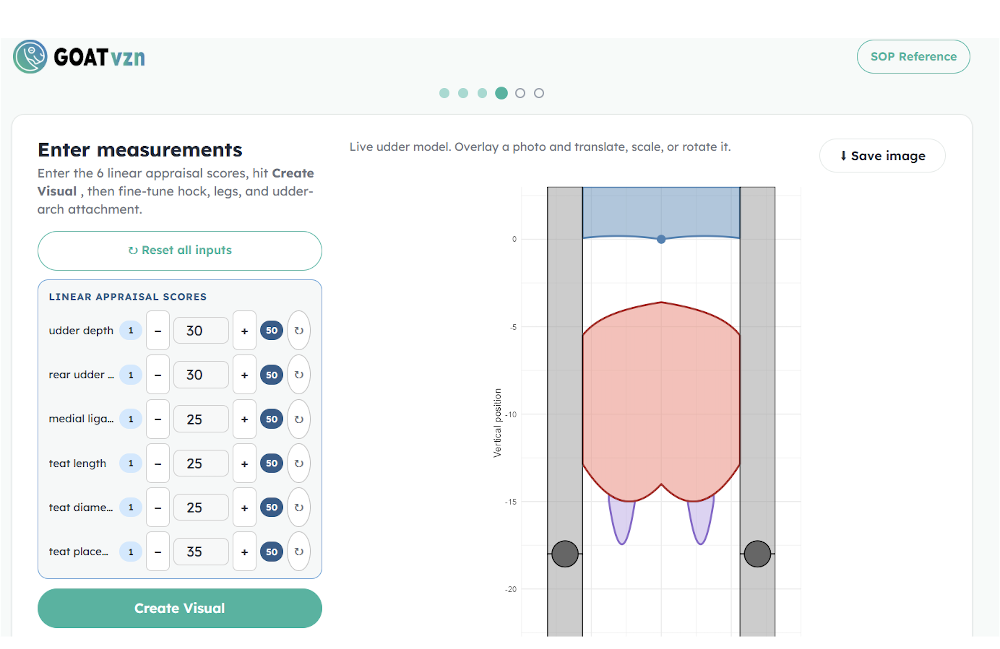
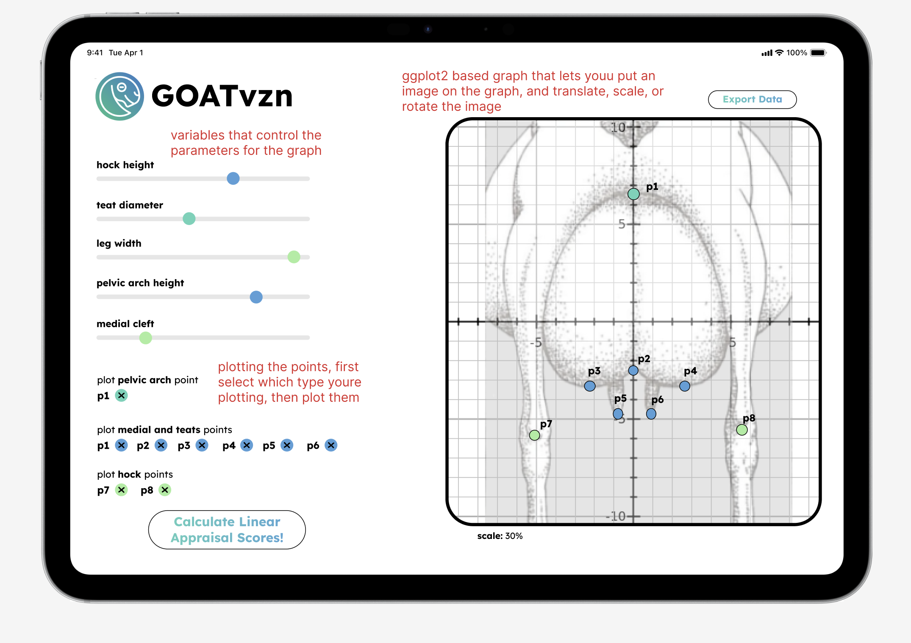

# Ag-Goat 🐐

*Working Title – Subject to Revision*

*This is a live document, and will be subject to change as the project progresses*

*This project is intended to support training and continuing education in appraising goat mammary systems. The ADGA linear appraisal system converts visual evaluation into standardized numerical measurements that are associated with ease of milking, udder durability, mastitis resistance, and long-term productivity. Because these scores are used in breeding and herd management decisions, consistent interpretation can affect breeding value estimation and long-term herd improvement.*

## Background:

This project is being developed in collaboration with the American Dairy Goat Association (ADGA) and UC Davis.

The ADGA is the primary organization that sets standards and maintains records for dairy goats in the U.S. One of its key programs is the Linear Appraisal System, which evaluates goats based on physical traits. In this system, trained appraisers evaluate physical traits related to mammary function, and dairy characteristics.


These evaluations are used to support:

* breeding decisions
* herd management
* genetic evaluation and research


Each trait is scored on a 1 - 50 scale based on observable physical variation. In the ADGA system, these scores are treated as a “linear” description of a trait, meaning they describe a range of biological variation rather than assigning a ranking of good or bad.

> “The term ‘linear’ in a linear appraisal system refers to the fact that traits are rated on a linear scale that goes from one biological extreme for that trait to the other.”
>
> — ADGA Linear Appraisal Booklet

For example, a trait score may describe differences in udder height, teat placement, or leg structure. The goal of the system is to create a more standardized and consistent way to describe dairy goat conformation across herds and appraisers.

However, interpreting the relationship between numeric scores and physical form still depends heavily on visual experience and in-person training. Outside formal appraisal sessions, it can be difficult to consistently visualize what different trait scores represent in practice, which can contribute to variation between appraisers.

## Project Focus: 

The goal is to build an application that takes linear appraisal scores for mammary traits and converts them into a visual rear-view model of the udder.

This project focuses specifically on the mammary system from the rear view (the udder and teat structures responsible for milk production), a component of dairy goat evaluation.

Key traits include:

* rear udder height
* udder depth
* udder arch
* medial support (udder split)
* teat placement and length

These traits are associated with milk production, udder durability, and susceptibility to injury or mastitis. For example, excessively deep udders may be more vulnerable to injury and infection due to their proximity to the hocks and ground.

Because these evaluations are used in breeding and herd management decisions, consistent interpretation of mammary traits is important for assessing long-term productivity and structural soundness in dairy goats. The scoring of these traits should be an approximate Gaussian distribution that represents the biological range seen across the goat population. In practice, appraisers estimate traits visually, which can lead to variation in scores. Specifically, a distribution that is too tight around the mean and therefore biologically unrepresentative.

This project explores whether linear appraisal traits can be translated into a visual rear-view udder model that could support appraisal training, score interpretation, and consistency between appraisers in and outside formal evaluation sessions.

### Trait Reference (ADGA)

The diagram below shows an example of how one trait (teat placement) is visualized in the ADGA Linear Appraisal system.


*Source: American Dairy Goat Association (ADGA), Linear Appraisal materials (LABOOKLETALL_19.pdf).*

This diagram is included as a reference to show how numeric scores correspond to physical traits. In the ADGA system, scores reflect differences in position, proportion, and structure (such as how centrally the teats are placed on the udder).

--
In focusing on the rear view of the udder, this project:

* converts numeric scores into a visual representation
* makes these traits easier to interpret
* helps check consistency in scoring
* provides a reference for training and validation
*  support training outside of formal appraisal sessions  

## How It Works

This project takes linear appraisal scores for mammary traits and converts them into a rear-view visual model of a dairy goat udder.

Users input trait values related to:

* udder height and depth
* udder shape and attachment
* medial support (udder split)
* teat placement and teat length

The system then uses those values to adjust different parts of the udder model and generate a corresponding visualization.

Different anatomical features are built as separate R scripts and combined through a Shiny application workflow. Rear leg and pelvic positioning are also included as reference points to help maintain proportional relationships within the model.

**The current prototype does not yet directly translate official ADGA linear appraisal scores into finalized biological representations.** Instead, the current system is being used to explore how trait-based parameters may be visually modeled and interpreted.
### Current Prototype Output

The image below shows the current visualization output generated from the Ag-GOAT mammary trait modeling workflow.  

The current prototype allows users to adjust mammary trait parameters and generate a rear-view udder visualization that can be used as a visual reference during development and testing.




### Workflow Diagram

The diagram below outlines the current development workflow for the project, including the separation of mammary traits into modular R source functions, integration through `app.R`, and planned future development stages.


### Future Development / Conceptual Features
The designs below represent exploratory interface and visual design concepts for the Ag-GOAT application. They are intended to demonstrate possible layout structure, workflow organization, and visual styling choices for future development.




[Figma Prototype / UI Planning](https://www.figma.com/design/ZpYCIH0f4AM39gjHRu5UR9/Ag-GOAT-UI?node-id=0-1&t=DCFXNh8wzVOKQWI8-1)

## INSTALLATION AND LOCAL USAGE
To run the prototype locally, first clone the repository and open the project folder:


### Required Packages

Before running the app, install the required R packages:

```r
install.packages(c("ggplot2", "shiny", "shinylive", "magick", "dplyr"))
```

### Running the App Locally

To run the prototype locally, first clone the repository and open the project folder in your terminal:

```bash
git clone git@github.com:datalab-dev/2026_startup_goats.git
cd 2026_startup_goats
```

Then open R or RStudio from the project folder and run:

```r
shiny::runApp("app")
```

The app should open in a browser window. If it does not open automatically, copy the local URL from the R console and paste it into your browser.

### Local Testing

For local testing, users can adjust the mammary trait inputs in the Shiny interface and confirm that the rear-view udder visualization updates correctly.

Testing should check whether:

* the app launches without errors
* the sliders or input fields respond correctly
* the generated visualization appears after values are entered
* changes in trait values produce visible changes in the model


## Data Organisation

### Google Drive Structure
[Google Drive]
(https://drive.google.com/drive/folders/1k2zZalMFZtyAQk7a1ZUKVJFEten8hQ5k?usp=sharing)

```
data/                         
├── Goat Pictures/                                 		   Images with scale reference (ruler) 
│   ├── rear udder trait scores        					   Google sheets file, including sample linear appraisal scores to calibrate web app 
├── rear udder image library/                      		   Rear-view udder images
├── [STUDENT] - Data Export Format 				 		   Sample data export format    
├── 2025 LA Data_Cleaned.xlsx                       	   Cleaned linear appraisal dataset with goat trait scores and standardized variables for analysis and modeling  
├── 2025 LA Data_Uncleaned.xlsx                     	   Raw linear appraisal dataset containing original recorded trait scores and animal information                      
└── goat_database.csv 									   Database of goat records for app input; derived from cleaned appraisal data
final report draft & reviews/
├── ava_wren_review.docx						   	       Student peer-review on final report draft
├── goat_sabrina_cheung copy.docx				  		   Student peer-review on final report draft
├── wk08_final_report_template.docx						   Project final report draft
└── wk08_Yiwei_Zheng_goat.docx							   Student peer-review on final report draft
scoping_documentation/
├── Linear Modeling Tool Grant_DataLab_2026.docx  		   Project proposal outlining goals, methods, and planned development
├── Scoping Meeting Notes                        		   Notes from initial project discussions and planning meetings
└── scoping_document.docx                        		   Formal project scope, roles, responsibilities, and deliverables
student_documents/
├── linear score tables 								   Document detailing measurement values against corresponding linear appraisal scores
├── Meeting Notes                             		       Notes from meetings with project lead and principal investigators  
├── Readme First Draft 							  		   Initial draft of project readme  
└── Student Meeting Notes                        		   Notes from internal student team meetings  
2025Linear-SOPDraft1.pdf                      		       Documentation of ADGA Linear Appraisal traits and scoring system  
Appenate – Linear Appraisal Data Gathering Presentation    Supplemental information on how appraisers use Appenate to enter and submit linear appraisal data.
Data Inventory                                		       Metadata table describing datasets used in the project, including size, source, and structure  
goat_final_presentation									   Final class presentation, including project background, outcomes, recommendations, and reflections.
goat_final_report 										   Final written report describing the project background, prototype outcomes, discussion, limitations, and recommendations.
Linear 2025.pptx                                		   Data analysis and visualizations of 2025 appraisal scores, including trait distributions and inter-appraiser variability  

```

### Github Repository Structure


```
app/                              R source code
├── R/                            R functions
│   ├── goat_parts/               Goat anatomy curve functions
│   │   ├── leg_curve.R           Function: rear leg / hock reference (used for proportional scoring)
│   │   ├── medial_curve.R        Function: medial suspensory ligament (udder support)
│   │   ├── pelvic_curve.R        Function: pelvic arch reference (anchor for udder traits)
│   │   ├── teats_curve.R         Function: teat placement and length (rear view)
│   │   ├── udder_curve.R         Function: udder shape (height, depth, arch)
│   │   └── score_geometry.R      Function: geometric calculations for scoring
│   ├── pages/                    Per-page UI and logic modules
│   │   ├── 1_page/
│   │   │   ├── logic_1.R         Page 1 behavior and server-side logic
│   │   │   └── ui_1.R            Page 1 layout and visual design
│   │   ├── 2_page/
│   │   │   ├── logic_2.R         Page 2 behavior and server-side logic
│   │   │   └── ui_2.R            Page 2 layout and visual design
│   │   ├── 3_page/
│   │   │   ├── logic_3.R         Page 3 behavior and server-side logic
│   │   │   └── ui_3.R            Page 3 layout and visual design
│   │   ├── 4_page/
│   │   │   ├── logic_4.R         Page 4 behavior and server-side logic
│   │   │   └── ui_4.R            Page 4 layout and visual design
│   │   ├── 5_page/
│   │   │   ├── logic_5.R         Page 5 behavior and server-side logic
│   │   │   └── ui_5.R            Page 5 layout and visual design
│   │   ├── 6_page/
│   │   │   ├── logic_6.R         Page 6 behavior and server-side logic
│   │   │   └── ui_6.R            Page 6 layout and visual design
│   │   └── nav.R                 Navigation logic
│   ├── data_cleaning.R           Data preprocessing
│   ├── score.R                   Function: trait scoring logic
│   ├── ui_helpers.R              UI utility functions
│   ├── ui_teats.R                Prototype Shiny UI for testing visualization
│   └── utils.R                   Shared utility functions
├── www/                          Static web assets
│   ├── TEXTGOATvznLogo.png       App logo
│   └── styles.css                App stylesheet
├── app.R                         App entry point
├── global.R                      Global variables and dependencies
├── server.R                      Shiny server logic
└── ui.R                          Shiny UI layout
data/                             Will contain rear udder reference images for input parameterization
docs/                             Supporting documents
├── Goat-Project-Report.pdf       Final written report describing the project background, discussion, limitations, and recommendations
├── README_TEATS.md               
├── dummyDataClean.csv            Sample cleaned dataset for development and testing
├── goat_data_dictionary.xlsx     Reference document describing datasets, variables, trait abbreviations, and source information
├── team_agreement.md             Team workflow guidelines and collaboration expectations
└── userChangeable Points.png     Diagram of user-adjustable scoring parameters
images/
├── 325RU.HEIC 					  Sample goat image used for app testing                   
├── Ag-GOAT_Figma.png             UI design prototype
├── Ag-GOAT_Week7Progress.png     Week 7 progress snapshot
├── current-prototype.png         Current app prototype screenshot
├── goat_timeline_workflow.png    Visual timeline of project development stages and milestones
├── goat_workflow.png             Diagram showing how project scripts and application components connect
├── landmark-system-prototype.png Prototype screenshot of the landmark detection system
└── teat_placement.png            ADGA diagram showing teat placement scoring scale
.gitignore                        Paths Git should ignore
README.md                         This file
```


### API Documentation

- [Goat Data Dictionary](docs/goat_data_dictionary.xlsx)  
  Reference document describing datasets, variables, trait abbreviations, and source information used throughout the project.

## Contributors

### Principal Investigators
**Fauna Smith**  
Assistant Professor  
flsmith@ucdavis.edu  

**Ben Rupchist**  
Manager, Goat Teaching & Research Facility  
barupchis@ucdavis.edu  

**Nora Manring**  
Student Assistant, Goat Teaching & Research Facility  
ezmanring@ucdavis.edu  

### Data Lab Project Lead
**Colton Baumler**  
PhD Candidate  
ccbaumler@ucdavis.edu  

### Data Lab Consultant
**Nick Ulle**  
Senior Statistician  
naulle@ucdavis.edu  

### Student Developers
**Camila Chicatto**  
Undergraduate Student  
cchicatto@ucdavis.edu  

**Hilary Choi**  
Undergraduate Student  
hfchoi@ucdavis.edu  

**Justin Huang**  
Undergraduate Student  
jjhhwang@ucdavis.edu  

**Rashmit Shrestha**  
Undergraduate Student  
rlshrestha@ucdavis.edu  

**Odelyn Xie**  
Undergraduate Student  
delxie@ucdavis.edu  


